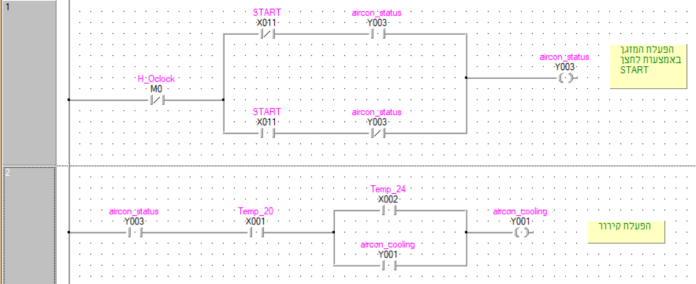
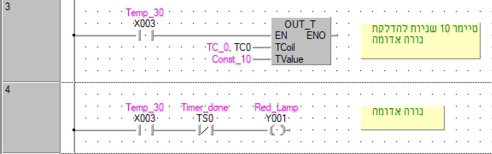
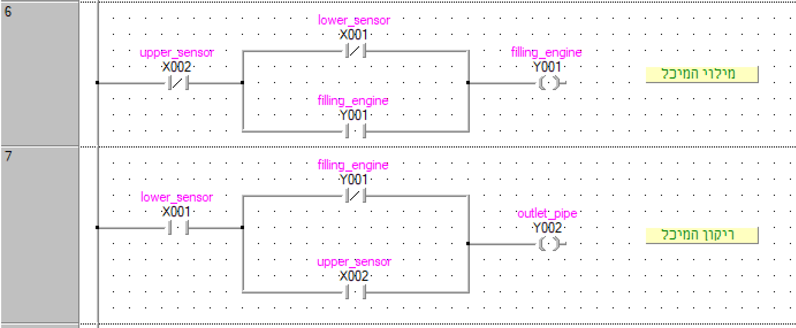
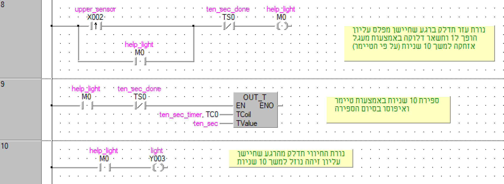
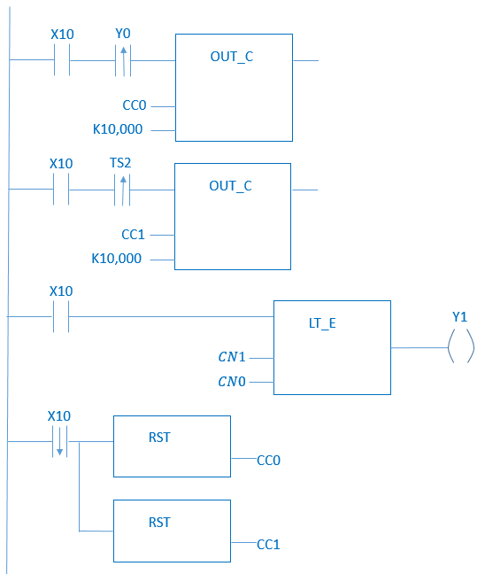

::: {.exercise}
**מערכת בקרת מזגן**

יש לכתוב תוכנית המפעילה מזגן. המזגן מופעל באמצעות לחצן START שהוא מתג קפיצי ומופסק בכל שעה עגולה או לאחר לחיצה נוספת על לחצן START (המשמש גם כלחצן STOP). פעולת **הקירור** מופעלת ברגע שהטמפרטורה עולה על 24°C ומפסיקה ברגע שהטמפרטורה יורדת מתחת ל-20°C. בכל פעם שהטמפרטורה עולה על 30°C נדלקת נורה אדומה למשך 10 שניות. ניתן להניח כי מצב בו לוחצים על לחצן START בדיוק בשעה עגולה אינו אפשרי.

**שימו לב:** יש להבדיל בין מצבו הכללי של המזגן (דלוק/כבוי) לפעולת הקירור.

1. הגדרו משתני קלט ופלט נדרשים.
2. תארו טבלת אמת ומפת קרנו.
3. ממשו את המערכת באמצעות דיאגרמת סולם.
:::

::: {.solution}
**1. משתני קלט ופלט:**

*משתני קלט:*

- $X_1$ — חיישן טמפרטורה 1 (1: טמפ' מעל 20°C, 0: מתחת ל-20°C)
- $X_2$ — חיישן טמפרטורה 2 (1: טמפ' מעל 24°C, 0: מתחת ל-24°C)
- $X_3$ — חיישן טמפרטורה 3 (1: טמפ' מעל 30°C, 0: מתחת ל-30°C)
- $X_{11}$ — לחצן START (1: הייתה לחיצה, 0: לא הייתה)
- $H$ — פולס בעלייה כאשר הגיעה שעה עגולה
- $T_0$ — טיימר 10 שניות עבור הנורה האדומה

*משתני פלט:*

- $Y_1$ — מדחס המזגן (1: מזגן מקרר, 0: לא מקרר)
- $Y_2$ — נורה אדומה מעל 30°C (1: דולקת, 0: כבויה)
- $Y_3$ — מצב כללי של המזגן (1: מופעל, 0: מכובה)

---

**2. טבלאות אמת ומפות קרנו:**

*הפעלת המזגן ($Y_3$):*

| הסבר | $Y_3$ (קודם) | $H$ | $X_{11}$ | $Y_3$ (חדש) |
|------|:---:|:---:|:---:|:---:|
| אין לחיצה, מזגן כבוי — נשאר כבוי | 0 | 0 | 0 | 0 |
| אין לחיצה, לא עברה שעה — מזגן ממשיך לפעול | 1 | 0 | 0 | 1 |
| עברה שעה, מזגן היה כבוי — נשאר כבוי | 0 | 1 | 0 | 0 |
| עברה שעה, מזגן היה פועל — מכובה | 1 | 1 | 0 | 0 |
| לחיצה על START, מזגן היה כבוי — מופעל | 0 | 0 | 1 | 1 |
| לחיצה על START, מזגן פעל — מכובה | 1 | 0 | 1 | 0 |

$$Y_3 = \overline{H}\,(\overline{X_{11}} \cdot Y_3 + X_{11} \cdot \overline{Y_3})$$

*הפעלת קירור ($Y_1$) — כאשר $Y_3=1$:*

$$Y_1 = Y_3 \cdot X_1 \cdot (X_2 + Y_1)$$

*נורה אדומה ($Y_2$):*

$$Y_2 = X_3 \cdot \overline{T_0}$$

---

**3. דיאגרמת סולם:**

{width=85%}

{width=85%}
:::

---

::: {.exercise}
**מערכת בקרת מיכל ערבוב**

עליכם לתכנן מערכת בקרה לתהליך מחזורי של ערבוב והזרמת שני חומרים כימיים במפעל לייצור דשנים. ערבוב החומרים מתבצע בתוך מיכל בנפח 600 ליטרים. כאשר מפלס החומרים במיכל מגיע לסף המינימום, מופעל מנוע המזרים למיכל את שני החומרים במקביל עד מילוי המיכל לרמה המקסימלית. ברגע ההגעה לרמה המקסימלית מופסקת עבודת המנוע ונפתח פתח ניקוז בתחתית המיכל. בנוסף, ברגע ההגעה לרמה המקסימלית נדלקת למשך 10 שניות נורת חיווי. לאחר שהמיכל מתרוקן ומפלס החומרים מגיע לסף המינימום, מתחיל שוב התהליך.

1. הגדרו משתני קלט ופלט נדרשים.
2. תארו טבלת אמת ומפת קרנו.
3. ממשו את המערכת באמצעות דיאגרמת סולם.
:::

::: {.solution}
**1. משתני קלט ופלט:**

*משתני קלט:*

- $X_1$ — חיישן מפלס תחתון (1: מזהה נוזל, 0: לא מזהה)
- $X_2$ — חיישן מפלס עליון (1: מזהה נוזל, 0: לא מזהה)

*משתני פלט:*

- $Y_1$ — מנוע מילוי (1: פועל, 0: כבוי)
- $Y_2$ — פתח ניקוז (1: פתוח, 0: סגור)
- $Y_3$ — נורת חיווי (1: דולקת, 0: כבויה)

---

**2. ביטויים לוגיים:**

*מנוע מילוי ($Y_1$):*

$$Y_1 = \overline{X_2}\,(\overline{X_1} + Y_1)$$

*פתח ניקוז ($Y_2$):*

$$Y_2 = X_1\,(\overline{Y_1} + X_2)$$

*נורת חיווי ($Y_3$):*

$$Y_3 = X_2$$

---

**3. דיאגרמת סולם:**

{width=85%}

{width=85%}
:::

---

::: {.exercise}
**מערכת למניעת יושבנות**

עליכם לפתח מערכת למניעת יושבנות. למערכת מתג הפעלה ראשי ואות של חיישן ישיבה משעון חכם. כאשר עוברת יותר משעה רצופה בה המשתמש יושב, המערכת מפעילה את הפעמון למשך עד דקה כל עוד המשתמש ממשיך לשבת. כאשר המשתמש אינו יושב במשך חצי שעה ברצף המערכת מזהה כי המשתמש התעמל. במידה והמשתמש יושב יותר מחמש שעות (לא בהכרח ברצף) ללא שהתעמל, המערכת מפעילה את הפעמון ברצף. כאשר מספר הפעמים שהמשתמש התעמל קטן ממספר הפעמים שהפעמון פעל, דולקת נורת אזהרה. המערכת מופעלת מחדש כל בוקר.

| משתנה | כניסה/יציאה | תפקיד | מצב כאשר ערכו 1 |
|-------|-------------|--------|-----------------|
| $X_{10}$ | כניסה | מתג ראשי | הפעלה |
| $X_1$ | כניסה | חיישן ישיבה | יושב |
| $Y_0$ | יציאה | פעמון | מצלצל |
| $Y_1$ | יציאה | נורת אזהרה | דולקת |

1. בחרו את כל המונים (מוני זמן / מוני אירועים) הדרושים. ציינו את סוג ומאפייני כל מונה. הסבירו.
2. אילו משתנים צריך לאפס בכל פעם שמפעילים את המערכת מחדש?
3. מה הוא הביטוי הלוגי המינימלי עבור הפעמון ועבור נורת האזהרה?
4. ממשו את הביטויים באמצעות דיאגרמת סולם.
:::

::: {.solution}
**1. מונים וטיימרים:**

| משתנה | סוג | תפקיד | מצב כאשר ערכו 1 |
|-------|-----|--------|-----------------|
| TC0 | טיימר ללא זיכרון | משך ישיבה רצופה — שעה | חלפה שעה של ישיבה |
| TC1 | טיימר ללא זיכרון | צלצול פעמון — דקה | חלפה דקה של צלצול |
| TC2 | טיימר ללא זיכרון | טיימר עמידה — חצי שעה | זוהה שהתעמל |
| TC246 | טיימר שומר זיכרון | זמן ישיבה כוללת — חמש שעות | חלפו 5 שעות ללא התעמלות |
| CC0 | קאונטר | מונה מספר צלצולי הפעמון | הגיע ליעד |
| CC1 | קאונטר | מונה מספר התעמלויות | הגיע ליעד |

**הסבר:** TC246 הוא טיימר שומר זיכרון כי הישיבה לא חייבת להיות רצופה — הטיימר צריך לצבור את הזמן גם בין הפסקות. TC0, TC1, TC2 הם ללא זיכרון כי הם מודדים ישיבה/עמידה רצופה בלבד.

---

**2. משתנים לאיפוס בהפעלה מחדש:**

יש לאפס: **CC0**, **CC1**, ו-**TC246**.

CC0 ו-CC1 הם מונים המצטברים לאורך היום ולכן חייבים להתאפס בכל בוקר. TC246 הוא טיימר שומר זיכרון שלא מתאפס לבד ולכן גם הוא דורש איפוס ידני.

---

**3. ביטויים לוגיים:**

*פעמון ($Y_0$):*

תנאי 1 — ישיבה רצופה מעל שעה, פעמון דולק עד דקה:

$$TC_0 \cdot \overline{TC_1}$$

תנאי 2 — ישיבה מצטברת מעל 5 שעות ללא התעמלות:

$$TC_{246} \cdot X_1$$

**ביטוי סופי לפעמון:**

$$Y_0 = X_{10} \cdot \left(TC_0 \cdot \overline{TC_1} + TC_{246} \cdot X_1\right)$$

**ביטוי סופי לנורת אזהרה:**

$$Y_1 = X_{10} \cdot \left(1 \text{ אם } CC_1 < CC_0,\ \text{אחרת } 0\right)$$

---

**4. דיאגרמת סולם:**

{width=85%}
:::
