## ★ רמת תרגול

שאלות בסיסיות להבנת העקרונות והתרגול הראשוני. מתאימות לתרגול שוטף ולהיכרות עם החומר.

---

::: {.exercise}
**שאלה 1.1: מערכת בקרת מיכל ערבוב**

עליכם לתכנן מערכת בקרה לתהליך מחזורי של ערבוב והזרמת שני חומרים כימיים במפעל לייצור דשנים. ערבוב החומרים מתבצע בתוך מיכל בנפח 600 ליטרים. כאשר מפלס החומרים במיכל מגיע לסף המינימום, מופעל מנוע המזרים למיכל את שני החומרים במקביל עד מילוי המיכל לרמה המקסימלית. ברגע ההגעה לרמה המקסימלית מופסקת עבודת המנוע ונפתח פתח ניקוז בתחתית המיכל. בנוסף, ברגע ההגעה לרמה המקסימלית נדלקת למשך 10 שניות נורת חיווי. לאחר שהמיכל מתרוקן ומפלס החומרים מגיע לסף המינימום, מתחיל שוב התהליך.

1. הגדרו משתני קלט ופלט נדרשים.
2. תארו טבלת אמת ומפת קרנו.
3. ממשו את המערכת באמצעות דיאגרמת סולם.
:::

::: {.callout-note collapse="true" title="▸ הצג פתרון"}
**1. משתני קלט ופלט:**

*משתני קלט:*

- $X_1$ — חיישן מפלס תחתון (1: מזהה נוזל, 0: לא מזהה)
- $X_2$ — חיישן מפלס עליון (1: מזהה נוזל, 0: לא מזהה)

*משתני פלט:*

- $Y_1$ — מנוע מילוי (1: פועל, 0: כבוי)
- $Y_2$ — פתח ניקוז (1: פתוח, 0: סגור)
- $Y_3$ — נורת חיווי (1: דולקת, 0: כבויה)

---

**2. ביטויים לוגיים:**

*מנוע מילוי ($Y_1$):*

$$Y_1 = \overline{X_2}\,(\overline{X_1} + Y_1)$$

*פתח ניקוז ($Y_2$):*

$$Y_2 = X_1\,(\overline{Y_1} + X_2)$$

*נורת חיווי ($Y_3$):*

$$Y_3 = X_2$$

---

**3. דיאגרמת סולם:**

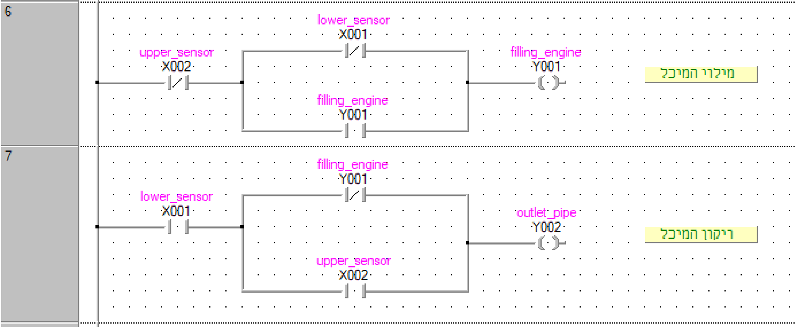{width=85%}

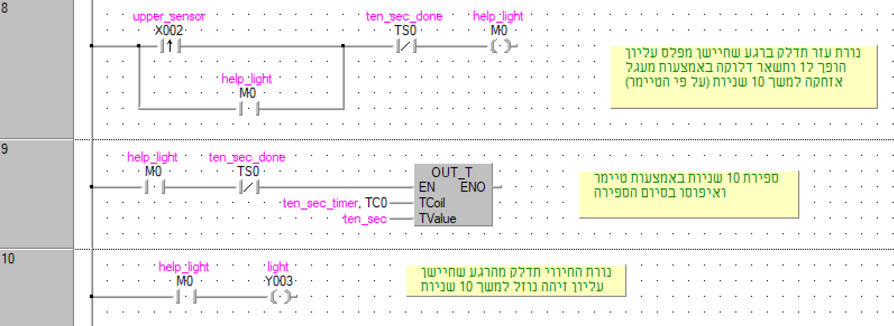{width=85%}
:::

---

::: {.exercise}
**שאלה 1.2: מערכת האכלת כלב**

עליכם לפתח בקר למערכת האכלת כלב. המערכת מאכילה את הכלב פעם ביום בשעה עגולה כמות קבועה של מזון. שק האוכל של הכלב מחובר עם ברז נשלט (שניתן לפתוח ולסגור) לכלי של הכלב.

הכלי מונח על משקל שנותן פלט בגרמים שמכוייל לכלי הריק (כאשר הכלי ריק פלט המשקל הוא אפס) ומוצא המשקל מחובר לרגיסטר D8280.

בעת ההתקנה בבית מכוונים את הקבועים במערכת: המשקל הרצוי של מזון בגרמים נכתב לרגיסטר D8281 ושעה ההאכלה הרצויה (23--0) נכתבת לרגיסטר D8282.

במערכת יש שעון זמן אמת והשעה ביום (23--0) נכתבת לרגיסטר D8283. לצרכי מעקב, מספר הארוחות שהכלב מקבל נכתב לרגיסטר D8284 ומוצג למשתמש.

למערכת מתג ראשי להפעלה וכיבוי. בעת שהמערכת פועלת היא פותחת את הברז בשעת ההאכלה והוא נשאר פתוח כל עוד משקל האוכל שהועבר לכלי נמוך מהמשקל הרצוי. אם עברו יותר מ-20 דקות מרגע פתיחת הברז והמשקל הרצוי טרם הושג המערכת סוגרת את הברז ומדליקה נורת תקלה.

המשתנים במערכת:

| משתנה | כניסה/יציאה | תפקיד | מצב כאשר ערכו 1 |
|-------|-------------|--------|-----------------|
| X10 | כניסה | מתג ראשי | הפעלה |
| ברז | יציאה | פקד ברז נשלט | פתוח |
| נורת תקלה | יציאה | פקד נורת תקלה | דולקת |
| M1 | יציאה | משתנה עזר למשקל הקערה | דולק |
| M2 | יציאה | משתנה עזר לשעת האכלה | דולק |
| TC0 | טיימר | טיימר 20 דק' | הגיע ליעד |
| D8280 | רגיסטר | משקל קערת האוכל | |
| D8281 | רגיסטר | המשקל הרצוי בקערה | |
| D8282 | רגיסטר | שעת האכלה רצויה | |
| D8283 | רגיסטר | שעון אמת | |
| D8284 | רגיסטר | מספר הארוחות שניתנו לכלב | |

1. בחרו מונה זמן עבור מנית 20 הדקות מבין המונים המתאימים ביותר לצרכי המערכת, הסבירו הבחירה.
2. מה הוא הביטוי הלוגי המינימלי עבור הברז ועבור נורת התקלה?
3. ממשו את מערכת הבקרה בעזרת דיאגרמת סולם עבור פקד הברז.
4. ממשו את מערכת הבקרה בעזרת דיאגרמת סולם עבור רישום מספר הארוחות.
:::

::: {.callout-note collapse="true" title="▸ הצג פתרון"}
**1. בחירת מונה זמן:**

נבחר במונה זמן ללא זיכרון (T0-T199 או T200-T245) כך שברגע בו כבר לא נדרש שמנוע הקירור יפעל — המונה יתאפס. בנוסף נעדיף לבחור מונה עם דיוק נמוך יותר מכיוון שנדרש ספירה של 20 דקות. לכן נכון לקחת מונה מקבוצת T0-T199. למשל T0 ואז תשובת הטיימר בהגעה ליעד תתקבל ברגיסטר TS0.

הטיימר מתחיל לפעול ברגע בו נפתח ברז האכלה ומסתיים עם סגירת הברז או בהגעה ל-20 דקות. השימוש בתשובת הטיימר נעשה בביטוי של נורת התקלה.

---

**2. ביטויים לוגיים:**

*משתני עזר:*

$$M_1 = \begin{cases} 1 & \text{if } D8280 = D8281 \\ 0 & \text{else} \end{cases}$$

$$M_2 = \begin{cases} 1 & \text{if } D8283 = D8282 \\ 0 & \text{else} \end{cases}$$

*ביטוי מינימלי לפקד הברז:*

$$\text{ברז} = X_{10} \cdot \overline{\text{נורת תקלה}} \cdot \overline{M_1} \cdot (\text{ברז} + M_2)$$

*ביטוי מינימלי לנורת התקלה:*

$$\text{נורת תקלה} = X_{10} \cdot TC_0$$

---

**3. דיאגרמת סולם לפקד הברז:**

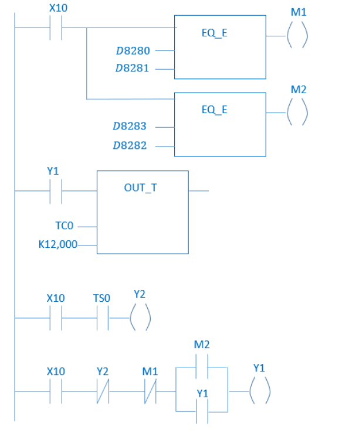{width=70%}

---

**4. דיאגרמת סולם לרישום מספר הארוחות:**

אפשרות ראשונה — בעזרת פונקציית חיבור:

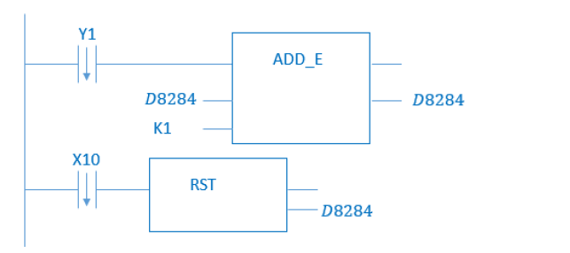{width=70%}

אפשרות שנייה — בעזרת קאונטר:

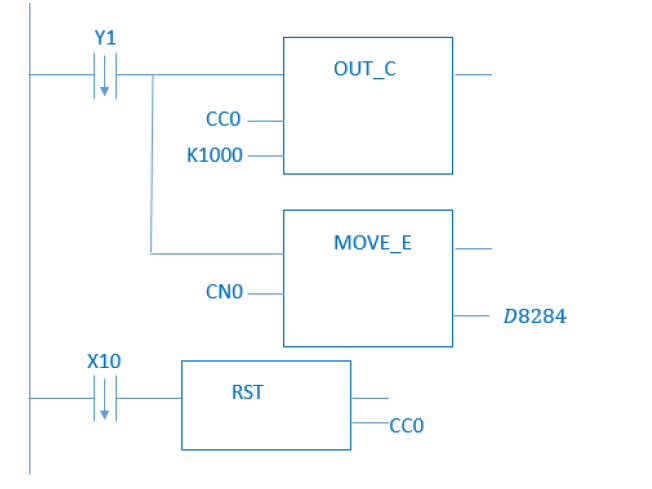{width=70%}
:::

---

## ★★ רמת קושי בינונית

שאלות מורכבות יותר הדורשות שילוב מספר מושגים. מתאימות להכנה למבחן.

---

::: {.exercise}
**שאלה 2.1: מערכת בקרת מזגן**

יש לכתוב תוכנית המפעילה מזגן. המזגן מופעל באמצעות לחצן START שהוא מתג קפיצי ומופסק בכל שעה עגולה או לאחר לחיצה נוספת על לחצן START (המשמש גם כלחצן STOP). פעולת **הקירור** מופעלת ברגע שהטמפרטורה עולה על 24°C ומפסיקה ברגע שהטמפרטורה יורדת מתחת ל-20°C. בכל פעם שהטמפרטורה עולה על 30°C נדלקת נורה אדומה למשך 10 שניות. ניתן להניח כי מצב בו לוחצים על לחצן START בדיוק בשעה עגולה אינו אפשרי.

**שימו לב:** יש להבדיל בין מצבו הכללי של המזגן (דלוק/כבוי) לפעולת הקירור.

1. הגדרו משתני קלט ופלט נדרשים.
2. תארו טבלת אמת ומפת קרנו.
3. ממשו את המערכת באמצעות דיאגרמת סולם.
:::

::: {.callout-note collapse="true" title="▸ הצג פתרון"}
**1. משתני קלט ופלט:**

*משתני קלט:*

- $X_1$ — חיישן טמפרטורה 1 (1: טמפ' מעל 20°C, 0: מתחת ל-20°C)
- $X_2$ — חיישן טמפרטורה 2 (1: טמפ' מעל 24°C, 0: מתחת ל-24°C)
- $X_3$ — חיישן טמפרטורה 3 (1: טמפ' מעל 30°C, 0: מתחת ל-30°C)
- $X_{11}$ — לחצן START (1: הייתה לחיצה, 0: לא הייתה)
- $H$ — פולס בעלייה כאשר הגיעה שעה עגולה
- $T_0$ — טיימר 10 שניות עבור הנורה האדומה

*משתני פלט:*

- $Y_1$ — מדחס המזגן (1: מזגן מקרר, 0: לא מקרר)
- $Y_2$ — נורה אדומה מעל 30°C (1: דולקת, 0: כבויה)
- $Y_3$ — מצב כללי של המזגן (1: מופעל, 0: מכובה)

---

**2. טבלאות אמת ומפות קרנו:**

*הפעלת המזגן ($Y_3$):*

| הסבר | $Y_3$ (קודם) | $H$ | $X_{11}$ | $Y_3$ (חדש) |
|------|:---:|:---:|:---:|:---:|
| אין לחיצה, מזגן כבוי — נשאר כבוי | 0 | 0 | 0 | 0 |
| אין לחיצה, לא עברה שעה — מזגן ממשיך לפעול | 1 | 0 | 0 | 1 |
| עברה שעה, מזגן היה כבוי — נשאר כבוי | 0 | 1 | 0 | 0 |
| עברה שעה, מזגן היה פועל — מכובה | 1 | 1 | 0 | 0 |
| לחיצה על START, מזגן היה כבוי — מופעל | 0 | 0 | 1 | 1 |
| לחיצה על START, מזגן פעל — מכובה | 1 | 0 | 1 | 0 |

$$Y_3 = \overline{H}\,(\overline{X_{11}} \cdot Y_3 + X_{11} \cdot \overline{Y_3})$$

*הפעלת קירור ($Y_1$) — כאשר $Y_3=1$:*

$$Y_1 = Y_3 \cdot X_1 \cdot (X_2 + Y_1)$$

*נורה אדומה ($Y_2$):*

$$Y_2 = X_3 \cdot \overline{T_0}$$

---

**3. דיאגרמת סולם:**

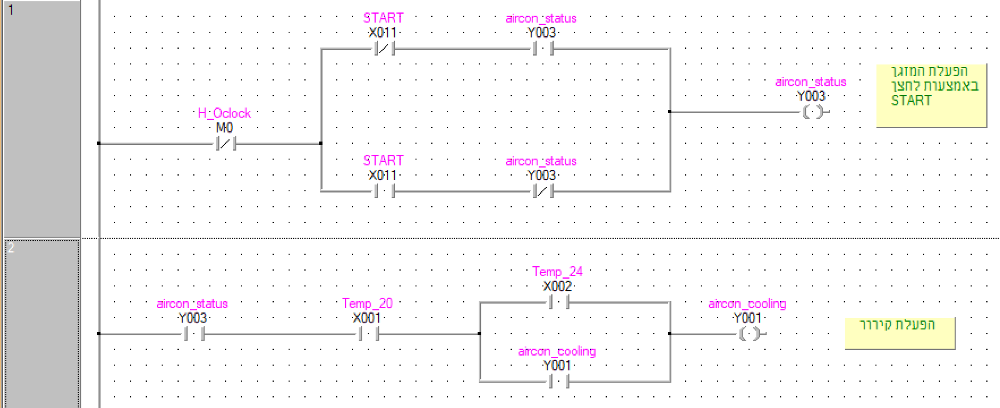{width=85%}

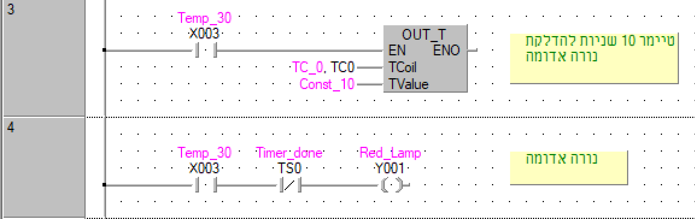{width=85%}
:::

---

::: {.exercise}
**שאלה 2.2: מערכת בקרת מקרר תעשייתי**

עליכם לפתח בקר למקרר תעשייתי. למקרר מתג ראשי המאפשר זרימה של חשמל למערכת. כאשר זורם חשמל ניתן להפעיל את המקרר בעזרת כפתור הפעלה קפיצי. כאשר הטמפרטורה יורדת מתחת ל-12°C מופסקת פעולת מנוע הקירור. כאשר הטמפרטורה עולה מעל ל-18°C מופעל מנוע הקירור. בכדי לא להרוס את המנוע יש השהייה של דקה מרגע שהוא נדרש לפעול עד שהוא אכן פועל.

| משתנה | כניסה/יציאה | תפקיד | מצב כאשר ערכו 1 |
|-------|-------------|--------|-----------------|
| $X_7$ | כניסה | כפתור הפעלה קפיצי | הדלקה |
| $X_{10}$ | כניסה | מתג ראשי | הפעלה |
| TmpB12 | כניסה | חיישן טמפרטורה — סף 12°C | מתקיים |
| TmpA18 | כניסה | חיישן טמפרטורה — סף 18°C | מתקיים |
| TA2 | כניסה | מונה זמן — דקה | מתקיים |
| $M_0$ | יציאה | מנוע קירור | פועל |

1. מה הוא הביטוי הלוגי המינימלי עבור מנוע הקירור. הדגימו את תהליך ההגעה לביטוי זה.
2. בחרו מונה זמן מבין המונים המתאים ביותר לצרכי המערכת, הסבירו את הבחירה. שרטטו את ענפי דיאגרמת הסולם הכוללים את מונה הזמן.
3. יועץ הציע ליישם מעגל החזקה עבור כפתור ההפעלה. הסבירו האם ומדוע נדרש מעגל האחזקה. במידה והיועץ שגה במימוש — הסבירו ושרטטו פתרון חליפי.
:::

::: {.callout-note collapse="true" title="▸ הצג פתרון"}
**1. ביטוי לוגי מינימלי עבור $M_0$:**

מכיוון שהפעלת המקרר נעשית בעזרת לחצן קפיצי, נשתמש במשתנה עזר $M_1$ להפעלת המערכת:

$$M_1 = (X_7 + M_1) \cdot X_{10}$$

*טבלת אמת עבור $M_0$:*

| TmpB12 | TmpA18 | $M_{0_t}$ | $M_{0_{t+1}}$ | הערות |
|:---:|:---:|:---:|:---:|:-----|
| 0 | 0 | 0 | 0 | טמפ' בין 12 ל-18, המנוע לא פעל — אין צורך להפעיל |
| 0 | 0 | 1 | 1 | טמפ' בין 12 ל-18, המנוע נמצא בפעולה — נשאיר פועל |
| 0 | 1 | 0 | 1 | טמפ' מעל 18°, נדרש להפעיל |
| 0 | 1 | 1 | 1 | טמפ' מעל 18°, ממשיך לפעול |
| 1 | 0 | 0 | 0 | טמפ' מתחת 12°, נדרש להפסיק |
| 1 | 0 | 1 | 0 | טמפ' מתחת 12°, עוצר |
| 1 | 1 | 0 | N/A | מצב לא אפשרי |
| 1 | 1 | 1 | N/A | מצב לא אפשרי |

לאחר הוספת תנאי הפעלת הבקר ודקת ההשהייה:

$$M_0 = M_1 \cdot TA_2 \cdot \overline{TmpB12} \cdot (TmpA18 + M_0)$$

---

**2. בחירת מונה זמן ודיאגרמת סולם:**

נבחר במונה זמן **ללא זיכרון** (T0--T199 או T200--T245) כך שברגע שלא נדרש שמנוע הקירור יפעל — המונה יתאפס. בנוסף נבחר דיוק של 0.1 שניות; נדרש ספירה של דקה בלבד (K600).

הטיימר מתחיל לפעול ברגע שנדרשת הפעלת מנוע הקירור ובתנאי שהמקרר פועל. כאשר הטיימר יגיע לסיום הדקה ערכו יהיה 1 וזה יוביל להפעלת מנוע הקירור.

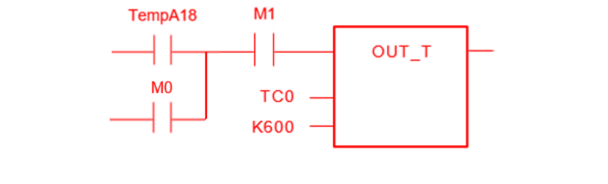{width=65%}

---

**3. מעגל האחזקה:**

נדרש מעגל אחזקה מכיוון שמדובר בלחצן קפיצי — ברגע לחיצה יתקבל פולס 1 למשך מחזור ריצה אחד ואז ערכו יחזור להיות 0.

**היועץ שגה:** מעגל האחזקה שלו הוא עבור $M_0$ (מנוע הקירור) ולא עבור הפעלת המערכת:

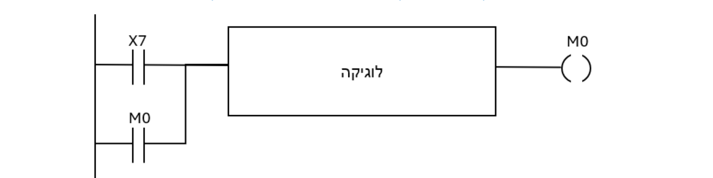{width=75%}

**פתרון חליפי:** מעגל האחזקה יהיה עבור $M_1$, ונוסיף את $X_{10}$:

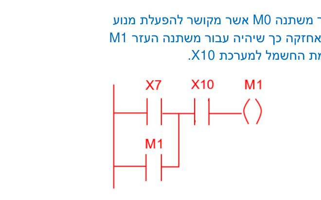{width=48%}
:::

---

::: {.exercise}
**שאלה 2.3: מערכת בקרת קורקינט**

לקורקינט הצהוב שני כפתורי בקרה קפיציים. כפתור קדמי מדליק או מכבה את הקורקינט, וכאשר הקורקינט דולק נורת לוח התצוגה שלו דולקת. הכפתור האחורי יוצר שינוי רק כאשר הקורקינט דולק: לחיצה ארוכה מ-40 שניות מחליפה את אינדקס תצורת התצוגה. יש שלוש תצורות תצוגה, והמעבר ביניהן מעגלי — אחרי השלישי חוזרים לראשון. את אינדקס תצורת התצוגה יש לשמור ברגיסטר D1100.

| משתנה | כניסה/יציאה | תפקיד | מצב כאשר ערכו 1 |
|-------|-------------|--------|-----------------|
| $X_7$ | כניסה | כפתור קדמי | כפתור לחוץ |
| $X_{10}$ | כניסה | כפתור אחורי | כפתור לחוץ |
| TS0 | כניסה | טיימר 40 שניות | עברו 40 שניות |
| CS0 | כניסה | קאונטר שינוי מוד | הגענו למוד האחרון |
| $Y_1$ | יציאה | נורת לוח התצוגה | קורקינט דולק |
| $M_0$ | יציאה | עזר לכיבוי קורקינט | כבה קורקינט |

1. הגדירו משתני קלט ופלט נדרשים.
2. רשמו טבלת אמת ואת הביטוי הלוגי המינימלי עבור נורת לוח התצוגה. במידה ואתם משתמשים במשתני עזר — רשמו את טבלת האמת והביטוי הלוגי גם עבורם.
3. ממשו את מערכת הבקרה כולה בעזרת דיאגרמת סולם. עבור פעולת הכפתור האחורי יש להשתמש גם במונה אירועים וגם במונה זמן ולפרט בדיאגרמה את חיבוריהם.
:::

::: {.callout-note collapse="true" title="▸ הצג פתרון"}
**2. ביטויים לוגיים:**

*משתנה עזר $M_0$ — כיבוי הקורקינט:*

נורת עזר לכיבוי תדלק רק כאשר כפתור קדמי לחוץ וגם נורת לוח התצוגה דולקת:

$$M_0 = Y_{1_t} \cdot X_7$$

*טבלת אמת עבור $Y_1$:*

| $X_7$ | $Y_{1_t}$ | $M_0$ | $Y_{1_{t+1}}$ | הסבר |
|:---:|:---:|:---:|:---:|:-----|
| 0 | 0 | 0 | 0 | קורקינט כבוי, לא לחוץ — נשאר כבוי |
| 0 | 1 | 0 | 1 | קורקינט פעל, עזר כבוי — ממשיך לפעול |
| 0 | 1 | 1 | 0 | קורקינט פעל, עזר דולק — נכבה |
| 1 | 0 | 0 | 1 | כפתור לחוץ, קורקינט כבוי — מופעל |
| 1 | 1 | 0 | 1 | כפתור לחוץ, קורקינט פעל, עזר כבוי — נשאר |
| 1 | 1 | 1 | 0 | כפתור לחוץ, קורקינט פעל, עזר דולק — נכבה |

$$Y_{1_{t+1}} = \overline{M_0} \cdot (Y_{1_t} + X_7)$$

---

**3. דיאגרמת סולם:**

הנחה: בהפעלה, ערך רגיסטר D1100 אותחל לערך ראשוני.

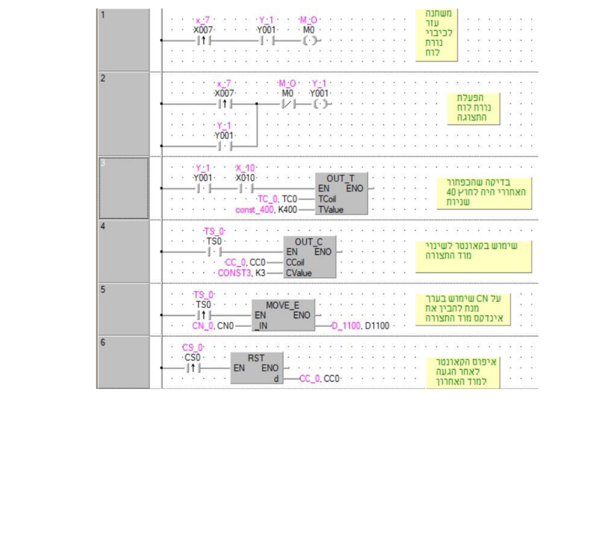{width=92%}
:::

---

::: {.exercise}
**שאלה 2.4: מערכת בקרת מכונת הדפסת חולצות**

במפעל הדפסת חולצות יש מערכת אוטומציה המבקרת את עבודת מכונת ההדפסה. למכונה יש יחידת הדפסה עם מנוע שתפקידו להורידה כלפי מטה. יש להפעיל את המכונה בעזרת מפסק הפעלה $X_1$. לאחר הנחת החולצה והסמל, המפעיל לוחץ על כפתור הדפסה קפיצי. המנוע מפעיל את יחידת ההדפסה כלפי מטה תוך זיהוי הפרעות בטיחותיות. אם מזוהה הפרעה — התנועה נעצרת ונורת תקלה נדלקת. התנועה מתחדשת רק לאחר לחיצה חוזרת על כפתור ההדפסה ללא הפרעה. כשיחידת ההדפסה מגיעה לחולצה, המנוע ממשיך לפעול 30 שניות (תהליך הדפסה), ואז מפסיק — ויחידת ההדפסה חוזרת לראש באמצעות קפיץ. כיבוי המכונה מפסיק את המנוע ומחזיר את יחידת ההדפסה לראש.

| משתנה | כניסה/יציאה | תפקיד | מצב כאשר ערכו 1 |
|-------|-------------|--------|-----------------|
| $X_1$ | כניסה | מפסק הפעלה | מצב "דולקת" |
| $X_{10}$/$X_7$ | כניסה | כפתור הדפסה קפיצי | כפתור לחוץ |
| dis_sen | כניסה | חיישן זיהוי הפרעה | זיהה אובייקט |
| down_sen | כניסה | חיישן מגע — הגעת יחידה לחולצה | זיהה מגע |
| TS_1 | כניסה | טיימר 30 שניות | הגיע ליעד |
| $Y_1$ | יציאה | נורת תקלה | דולקת |
| $Y_2$ | יציאה | מנוע יחידת ההדפסה | פועל |
| error_end | יציאה | עזר — לחיצה חדשה ללא הפרעה | מתקיים |

1. הגדירו משתני קלט ופלט נדרשים.
2. רשמו את הביטוי הלוגי המינימלי עבור נורת התקלה.
3. רשמו טבלת אמת ואת הביטוי הלוגי המינימלי עבור פעולת המנוע.
4. ממשו את מערכת הבקרה בעזרת דיאגרמת סולם, כולל הפעלת מונה הזמן ושימוש בו.
:::

::: {.callout-note collapse="true" title="▸ הצג פתרון"}
**2. ביטוי מינימלי עבור נורת התקלה $Y_1$:**

נורת התקלה תפעל כאשר המנוע פועל ומזוהה הפרעה, ותישאר דולקת עד לחיצה חדשה ללא הפרעה (error_end).

$$\text{error\_end} = (X_{10} + \text{error\_end}) \cdot \overline{\text{dis\_sen}}$$

$$Y_1 = (Y_2 \cdot \text{dis\_sen} + Y_1) \cdot \overline{\text{error\_end}}$$

---

**3. ביטוי מינימלי עבור המנוע $Y_2$:**

תנאים נוספים: $X_1=1$ (מפסק פעיל), $Y_1=0$ (אין תקלה).

*טבלת אמת עבור $Y_2$:*

| $X_{10}$ | TS_1 | $Y_{2_t}$ | $Y_{2_{t+1}}$ | הסבר |
|:---:|:---:|:---:|:---:|:-----|
| 0 | 0 | 0 | 0 | מנוע לא עובד, לא נלחץ — לא נדרש לעבוד |
| 0 | 0 | 1 | 1 | מנוע עובד, טיימר לא סיים — ממשיך |
| 0 | 1 | 0 | 0 | טיימר סיים, מנוע לא פעל — לא נדרש |
| 0 | 1 | 1 | 0 | טיימר סיים — נדרש להפסיק |
| 1 | 0 | 0 | 1 | נלחץ כפתור, מנוע לא עבד — מתחיל |
| 1 | 0 | 1 | 1 | נלחץ כפתור, מנוע עובד — ממשיך |
| 1 | 1 | 0 | 0 | טיימר סיים — נדרש להפסיק |
| 1 | 1 | 1 | 0 | טיימר סיים — נדרש להפסיק |

לאחר הוספת תנאי הפעלת המערכת ואי-תקלה:

$$Y_2 = X_1 \cdot \overline{Y_1} \cdot \overline{TS\_1} \cdot (X_{10} + Y_2)$$

---

**4. דיאגרמת סולם:**

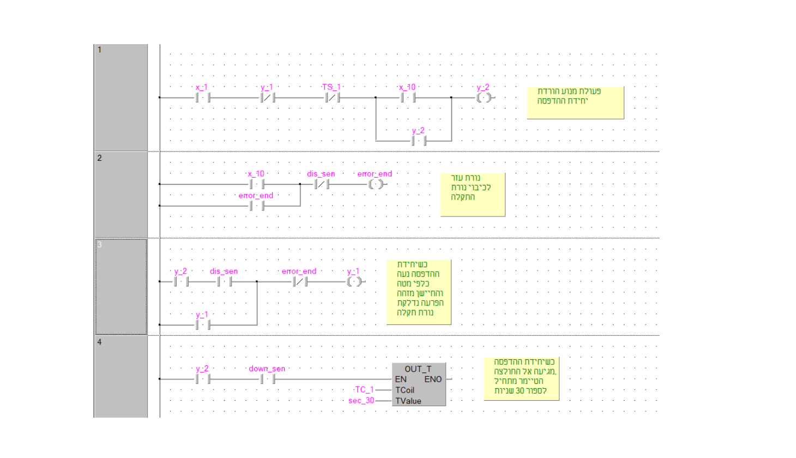{width=92%}
:::

---

## ★★★ רמת מבחן

שאלות ברמת מבחן, המחייבות חשיבה מעמיקה ושליטה מלאה בחומר.

---

::: {.exercise}
**שאלה 3.1: מערכת למניעת יושבנות**

עליכם לפתח מערכת למניעת יושבנות. למערכת מתג הפעלה ראשי ואות של חיישן ישיבה משעון חכם. כאשר עוברת יותר משעה רצופה בה המשתמש יושב, המערכת מפעילה את הפעמון למשך עד דקה כל עוד המשתמש ממשיך לשבת. כאשר המשתמש אינו יושב במשך חצי שעה ברצף המערכת מזהה כי המשתמש התעמל. במידה והמשתמש יושב יותר מחמש שעות (לא בהכרח ברצף) ללא שהתעמל, המערכת מפעילה את הפעמון ברצף. כאשר מספר הפעמים שהמשתמש התעמל קטן ממספר הפעמים שהפעמון פעל, דולקת נורת אזהרה. המערכת מופעלת מחדש כל בוקר.

| משתנה | כניסה/יציאה | תפקיד | מצב כאשר ערכו 1 |
|-------|-------------|--------|-----------------|
| $X_{10}$ | כניסה | מתג ראשי | הפעלה |
| $X_1$ | כניסה | חיישן ישיבה | יושב |
| $Y_0$ | יציאה | פעמון | מצלצל |
| $Y_1$ | יציאה | נורת אזהרה | דולקת |

1. בחרו את כל המונים (מוני זמן / מוני אירועים) הדרושים. ציינו את סוג ומאפייני כל מונה. הסבירו.
2. אילו משתנים צריך לאפס בכל פעם שמפעילים את המערכת מחדש?
3. מה הוא הביטוי הלוגי המינימלי עבור הפעמון ועבור נורת האזהרה?
4. ממשו את הביטויים באמצעות דיאגרמת סולם.
:::

::: {.callout-note collapse="true" title="▸ הצג פתרון"}
**1. מונים וטיימרים:**

| משתנה | סוג | תפקיד | מצב כאשר ערכו 1 |
|-------|-----|--------|-----------------|
| TC0 | טיימר ללא זיכרון | משך ישיבה רצופה — שעה | חלפה שעה של ישיבה |
| TC1 | טיימר ללא זיכרון | צלצול פעמון — דקה | חלפה דקה של צלצול |
| TC2 | טיימר ללא זיכרון | טיימר עמידה — חצי שעה | זוהה שהתעמל |
| TC246 | טיימר שומר זיכרון | זמן ישיבה כוללת — חמש שעות | חלפו 5 שעות ללא התעמלות |
| CC0 | קאונטר | מונה מספר צלצולי הפעמון | הגיע ליעד |
| CC1 | קאונטר | מונה מספר התעמלויות | הגיע ליעד |

**הסבר:** TC246 הוא טיימר שומר זיכרון כי הישיבה לא חייבת להיות רצופה — הטיימר צריך לצבור את הזמן גם בין הפסקות. TC0, TC1, TC2 הם ללא זיכרון כי הם מודדים ישיבה/עמידה רצופה בלבד.

---

**2. משתנים לאיפוס בהפעלה מחדש:**

יש לאפס: **CC0**, **CC1**, ו-**TC246**.

CC0 ו-CC1 הם מונים המצטברים לאורך היום ולכן חייבים להתאפס בכל בוקר. TC246 הוא טיימר שומר זיכרון שלא מתאפס לבד ולכן גם הוא דורש איפוס ידני.

---

**3. ביטויים לוגיים:**

*פעמון ($Y_0$):*

תנאי 1 — ישיבה רצופה מעל שעה, פעמון דולק עד דקה:

$$TC_0 \cdot \overline{TC_1}$$

תנאי 2 — ישיבה מצטברת מעל 5 שעות ללא התעמלות:

$$TC_{246} \cdot X_1$$

**ביטוי סופי לפעמון:**

$$Y_0 = X_{10} \cdot \left(TC_0 \cdot \overline{TC_1} + TC_{246} \cdot X_1\right)$$

**ביטוי סופי לנורת אזהרה:**

$$Y_1 = X_{10} \cdot [CC_1 < CC_0]$$

הסוגריים המרובעים: 1 אם התנאי מתקיים, 0 אחרת.

---

**4. דיאגרמת סולם:**

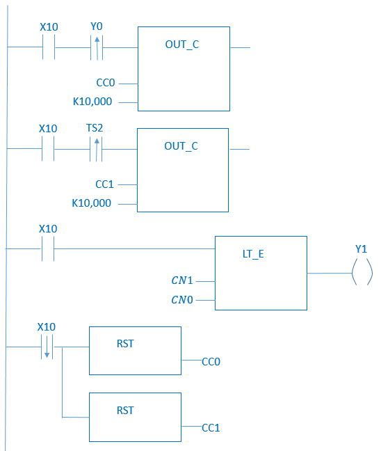{width=85%}
:::

---

::: {.exercise}
**שאלה 3.2: מערכת בקרה למכשיר לאפיית חלות**

עליכם לפתח גרסה ראשונית של בקר למכשיר לאפיית חלות. המכשיר מבצע לישה, התפחה ואפייה. למכשיר מיכל לחומרים, כפתור הפעלה קפיצי, משקל, מנוע לישה, גוף חימום לאפייה ונורת אזהרה. המכשיר מופעל בעזרת כפתור ההפעלה. אם כשהמכשיר מופעל המשקל גדול מ-0 נדלקת נורת האזהרה והיא נשארת דולקת עד לריקון המיכל. לאחר מכן מתחיל תהליך ההוספה, הלישה, ההתפחה והאפייה. בתום האפייה נדלקת נורת האזהרה שוב עד שמוציאים את החלה ובעקבות זאת המכשיר כבה. משך הלישה: 10 דקות. משך ההתפחה: שעה. משך האפייה: חצי שעה.

| משתנה | כניסה/יציאה | תפקיד | מצב כאשר ערכו 1 |
|-------|-------------|--------|-----------------|
| $X_1$ | כניסה | כפתור הפעלה קפיצי | מופעל |
| $Y_0$ | יציאה | מנוע לישה | פועל |
| $Y_1$ | יציאה | נורת אזהרה | דולקת |
| $Y_2$ | יציאה | גוף חימום | פועל |
| TC0 | מונה זמן | מונה זמן לישה — 10 דק' | סיום לישה |
| TC1 | מונה זמן | מונה זמן התפחה 1 — חצי שעה ראשונה | סיום חצי התפחה |
| TC2 | מונה זמן | מונה זמן התפחה 2 — חצי שעה שנייה | סיום כל ההתפחה |
| TC3 | מונה זמן | מונה זמן אפייה — חצי שעה | סיום אפייה |
| $M_0$ | יציאה | מעגל אחזקה לכפתור הקפיצי | המערכת עובדת |
| $M_1$ | יציאה | אינדיקטור — המיכל ריק | מיכל ריק |
| $M_2$ | יציאה | אינדיקטור לסיום אפייה | סיום אפייה |
| $M_3$ | יציאה | אינדיקטור — נוספו מספיק קמח ומים | משקל מיכל = 830 גר' |
| $M_4$ | יציאה | אינדיקטור לסיום התהליך וכיבוי | אפייה הסתיימה ומיכל ריק |
| D1100 | רגיסטר | רגיסטר משקל במכונה | --- |

1. הסבירו מה האתגר למימוש מניית זמן ההתפחה. הציעו פתרון למימוש מניית זמן זה והדגימו בעזרת שרטוט.
2. מה הוא הביטוי הלוגי המינימלי עבור כל אחד מהפלטים: מנוע הלישה $Y_0$, גוף החימום $Y_2$, ונורת האזהרה $Y_1$. הדגימו את תהליך ההגעה לביטוי כולל טבלת אמת ומפת קרנו עבור נורת האזהרה.
3. ממשו את הבקרה בעזרת דיאגרמת סולם עבור נורת האזהרה, כולל תכנות מוני הזמן הרלוונטיים.
:::

::: {.callout-note collapse="true" title="▸ הצג פתרון"}
**1. אתגר מניית זמן ההתפחה:**

האתגר הוא שצריך להתפיח שעה (3,600 שניות), אך הזמן המקסימלי שמוני הזמן בבקר יכולים למנות הוא 3,276.7 שניות בלבד.

הפתרון הוא **שרשור מונים**: נפצל לשני מונים שכל אחד מהם ימנה חצי שעה (18,000 × 0.1s). TS0 מפעיל את TC1; כשיסיים, TS1 מפעיל את TC2 — וכך מתקבלת שעה מלאה. נבחר מונים **ללא זיכרון** כי בכל אפיית חלה חדשה מתחילים מחדש.

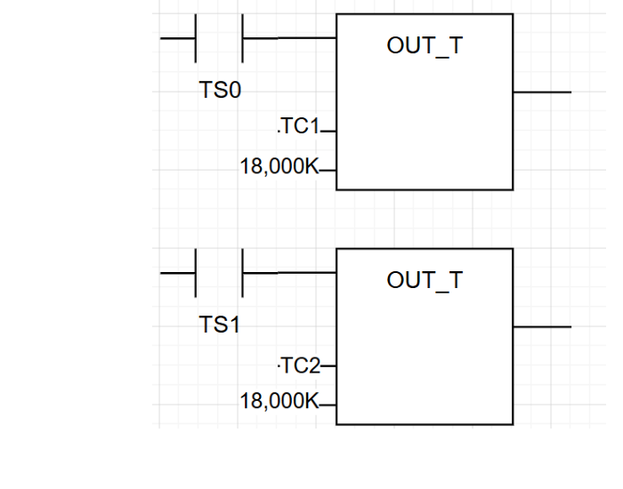{width=55%}

---

**2. ביטויים לוגיים מינימליים:**

*מנוע לישה $Y_0$:*

הלישה פעילה כשהמערכת דולקת, נוספו כל החומרים, נורת האזהרה כבויה, ומונה הלישה טרם סיים:

$$Y_0 = M_0 \cdot M_3 \cdot \overline{Y_1} \cdot \overline{TS_0}$$

*גוף חימום $Y_2$:*

האפייה מתחילה לאחר סיום ההתפחה ומסתיימת עם סיום מונה האפייה:

$$Y_2 = M_0 \cdot TS_2 \cdot \overline{TS_3}$$

*נורת אזהרה $Y_1$ — טבלת אמת:*

| $M_1$ | $X_1$ | $M_2$ | $Y_{1_t}$ | $Y_{1_{t+1}}$ הסבר |
|:---:|:---:|:---:|:---:|:-----|
| 0 | 0 | 0 | 0 | 0 — מיכל ריק, אין טריגר |
| 0 | 0 | 0 | 1 | 0 — מיכל ריק, תכבה |
| 0 | 0 | 1 | 0 | 0 — מיכל ריק, אין סיבה לדלוק |
| 0 | 0 | 1 | 1 | 0 — מיכל ריק, תכבה |
| 0 | 1 | 0 | 0 | 0 — מיכל ריק, כפתור פועל — לא תדלק |
| 0 | 1 | 0 | 1 | 0 — מיכל ריק, תכבה |
| 0 | 1 | 1 | 0 | N/A |
| 0 | 1 | 1 | 1 | N/A |
| 1 | 0 | 0 | 0 | 0 — משקל במכונה, אין טריגר |
| 1 | 0 | 0 | 1 | 1 — משקל במכונה, נשארת דולקת |
| 1 | 0 | 1 | 0 | 1 — אפייה הסתיימה, תדלק |
| 1 | 0 | 1 | 1 | 1 — אפייה הסתיימה, נשארת |
| 1 | 1 | 0 | 0 | 1 — כפתור פועל עם משקל, תדלק |
| 1 | 1 | 0 | 1 | 1 — נשארת דולקת |
| 1 | 1 | 1 | 0 | N/A |
| 1 | 1 | 1 | 1 | N/A |

שלוש קבוצות: $M_1 \cdot X_1$, $M_1 \cdot Y_1$, $M_1 \cdot M_2$:

$$Y_1 = \overline{M_1} \cdot (X_1 + Y_1 + M_2)$$

$\overline{M_1} = 1$ כאשר יש חומר במיכל. הנורה נדלקת עם הפעלה כשיש משקל, נשארת דולקת באחזקה, ומדלקת בסיום האפייה.

---

**3. דיאגרמת סולם:**

ענפי הפעלת $M_0$ ובדיקת משקל לקבלת $M_1$:

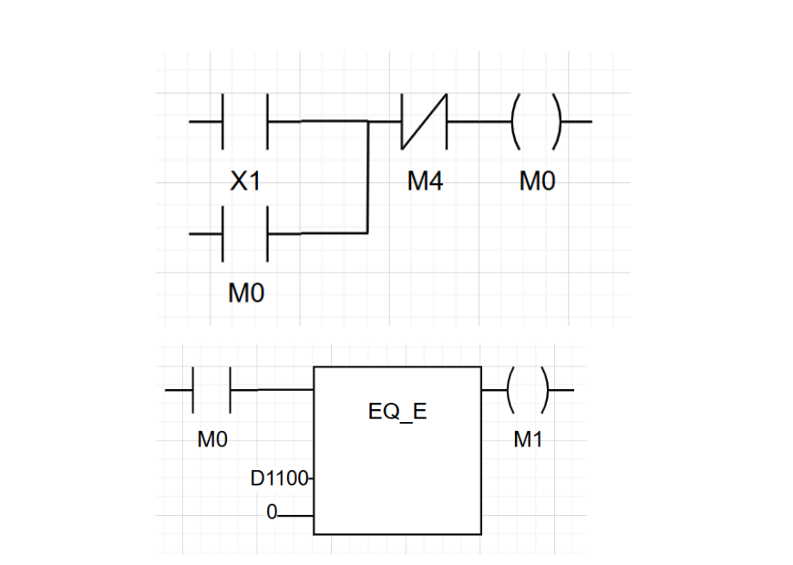{width=60%}

ענפי טיימר האפייה וסיום האפייה $M_2$:

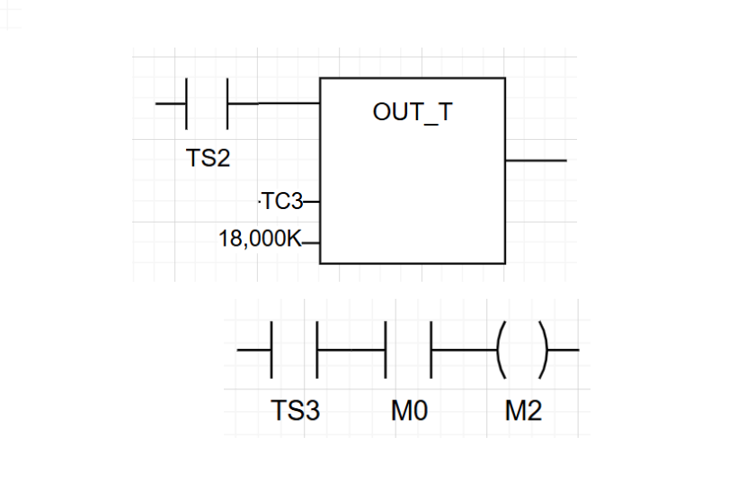{width=60%}

ענף נורת האזהרה $Y_1$ וסיום התהליך $M_4$:

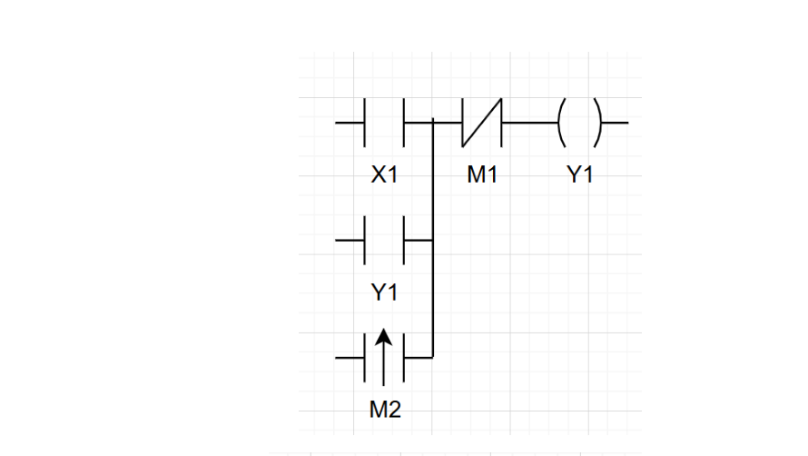{width=55%}

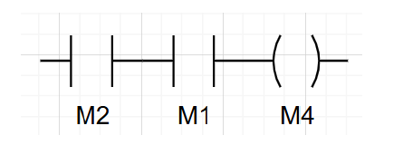{width=50%}
:::

---

::: {.exercise}
**שאלה 3.3: משחק מזל הא-ב**

למשחק "מזל הא-ב" מפסק הפעלה, שני כפתורים קפיציים אחד אדום והשני כחול ולוח תצוגה (עם בקר נוסף משלו). ללוח התצוגה פקד הדלקה/כיבוי ופקד הבהוב/תאורה רציפה. בקר לוח התצוגה יודע לגשת לרגיסטר D1100 ולקרוא משם האות שעליו להציג.

מדליקים את המשחק בעזרת מפסק ההפעלה. כאשר לוחצים על הכפתור האדום מוגרלת אות מהא-ב העברי. ייצוג של האות שהוגרלה נשמר ברגיסטר D1100. לאחר הלחיצה על הכפתור האדום נדלק לוח התצוגה ומוצגת עליו האות שנבחרה (תאורה רציפה).

כאשר יש אות בתאורה רציפה על לוח התצוגה יכול המשתתף ללחוץ על הכפתור הכחול בכדי לנסות לבחור את האות המוצגת. משך זמן הלחיצה פרופורציונלי למיקום האות בא-ב כאשר קיים זמן מחזור. זמן מחזור הינו הזמן העובר מתחילת הלחיצה עד שהאות הנבחרת היא תו ואחריו חוזרים לתחילת הא-ב.

במידה והמשתתף מצליח לגרום לכך שתבחר האות הנכונה לוח התצוגה מהבהב למשך 10 שניות (ללוח התצוגה פקודת הבהוב) אחרת אין שינוי בתצוגה. בעת כיבוי המערכת או לאחר סיום סיבוב משחק (10 השניות לאחר סיום הלחיצה על הכפתור הכחול) הערך ברגיסטר D1100 נמחק ואין תצוגה על הלוח.

בכל מקום שרלוונטי ההתייחסות לא-ב העברי הינה ללא אותיות סופיות.

| משתנה | כניסה/יציאה | תפקיד | מצב כאשר ערכו 1 |
|-------|-------------|--------|-----------------|
| X7 | כניסה | כפתור "בחר" | כפתור לחוץ |
| X10 | כניסה | כפתור "נחש" | כפתור לחוץ |
| TS2 | כניסה | טיימר 10 שניות | עברו 10 שניות |
| CS0 | כניסה | קאונטר 5 לחיצות | הגענו ליעד |
| Y1 | יציאה | נורת הדלקה/כיבוי | לוח התצוגה דולק |
| Y2 | יציאה | נורת תאורה | תאורה מהבהבת |
| M0 | יציאה | נורת עזר לשוויון בין המספרים | המספרים שהוגרלו זהים |
| D1100 | רגיסטר | שמירת מספר אחרי לחיצה על כפתור בחר | |
| D1102 | רגיסטר | שמירת מספר אחרי לחיצה על כפתור נחש | |

1. רשמו טבלת אמת ואת הביטוי הלוגי המינימלי לפקדי לוח התצוגה. במידה ואתם משתמשים במשתני עזר יש לרשום את טבלת האמת והביטוי הלוגי המינימלי גם עבורם.
2. ממשו את מערכת הבקרה כולה (יש להתייחס לכל הסיפור המתואר) בעזרת דיאגרמת סולם. במידה ומשתמשים במונה אירועים או במונה זמן יש לפרט בדיאגרמה את חיבוריהם.
:::

::: {.callout-note collapse="true" title="▸ הצג פתרון"}
**1. טבלת אמת וביטוי מינימלי לפקדי לוח התצוגה:**

מדובר בשתי פקודות שונות ונפרדות זו מזו, אשר מועברות מהבקר ללוח התצוגה. על פי המימוש שבוצע, מצב "0" עבור פקודת התאורה מייצג תאורה רציפה.

*טבלת האמת עבור פקודת הדלקה/כיבוי (Y1):*

| X7 | CS0 | $Y_1_t$ | $Y_1_{t+1}$ | הסבר |
|:---:|:---:|:---:|:---:|:-----|
| 0 | 0 | 0 | 0 | משחק המזל היה כבוי, לא נלחץ כפתור "בחר" ולכן נשאר כבוי |
| 0 | 0 | 1 | 1 | משחק המזל היה דלוק, לא שיחקנו 5 משחקים רצופים ולכן נשאר דלוק |
| 0 | 1 | 0 | 0 | שיחקנו 5 משחקים רצוף, משחק המזל היה כבוי ונדרש להישאר כבוי |
| 0 | 1 | 1 | 0 | משחק המזל היה דלוק, שיחקנו 5 משחקים ולכן נדרש לכבות |
| 1 | 0 | 0 | 1 | לחצנו על כפתור "בחר", המשחק היה כבוי ולכן נדרש להדליק |
| 1 | 0 | 1 | 1 | משחק המזל היה דלוק לחצנו שוב על כפתור "בחר" ולא שיחקנו 5 משחקים לכן נדרש להשאיר דלוק |
| 1 | 1 | 0 | N/A | ניתן להניח שאי אפשר ללחוץ על כפתור "בחר" בדיוק באותה שנייה שסיימנו 5 משחקים |
| 1 | 1 | 1 | 0 | משחק המזל היה דלוק, שיחקנו 5 משחקים ולכן נדרש לכבות |

$$Y_1_{t+1} = \overline{CS_0} \cdot (Y_1_t + X_7)$$

---

*טבלת האמת עבור פקודת התאורה (Y2):*

M0 תמיד שומרת את התשובה עבור פעולת השוויון האחרונה שבוצעה, לכן לא נדרש מעגל החזקה בחלק זה.

| M0 | TS2 | $Y_2_t$ | הסבר |
|:---:|:---:|:---:|:-----|
| 0 | 0 | 0 | אין שוויון בין המספרים ולכן לא נעבור לתצוגה מהבהבת |
| 0 | 1 | 0 | עברו 10 שניות ולכן התצוגה חוזרת לרציפה |
| 1 | 0 | 1 | יש שוויון והטיימר עוד לא הגיע ליעד ולכן נעבור לתצוגה מהבהבת |
| 1 | 1 | 0 | יש שוויון, אך הטיימר סיים ולכן התצוגה חוזרת לרציפה |

$$Y_2_t = M_0 \cdot \overline{TS_2}$$

---

**2. דיאגרמת סולם של כלל המערכת:**

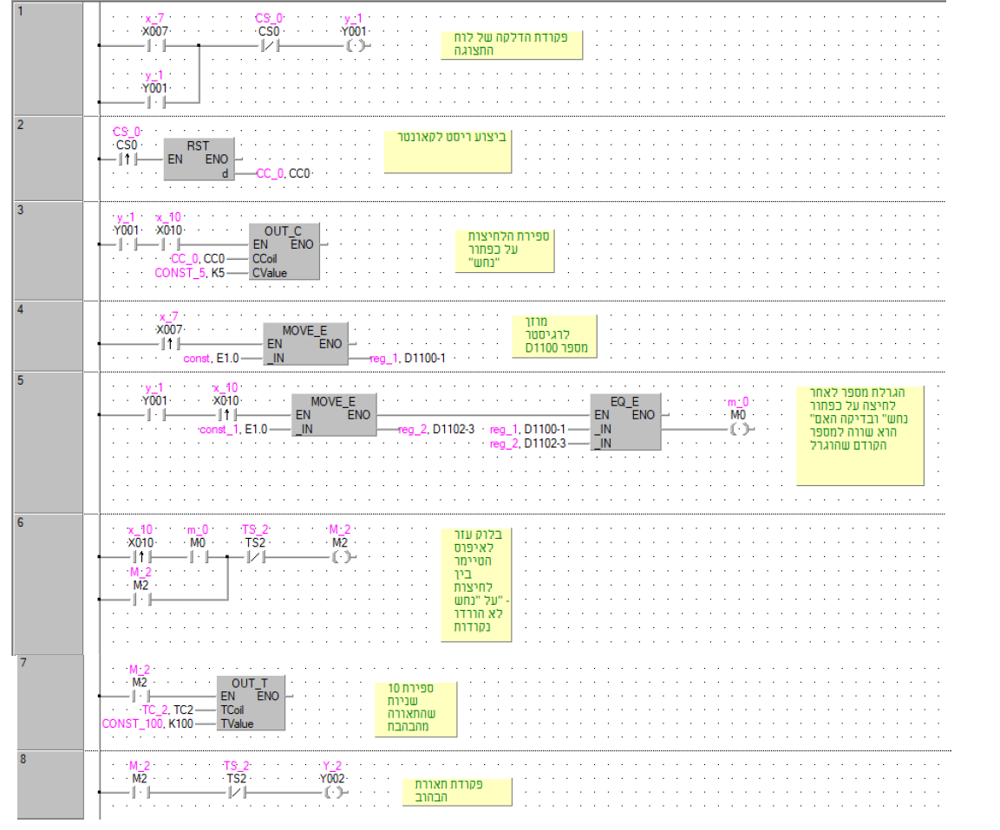{width=90%}
:::

---
